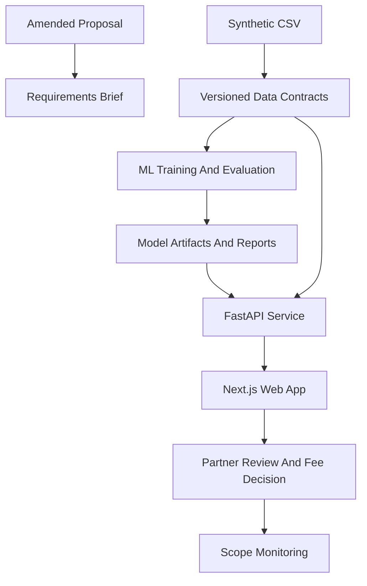

# ProForma HK Technical Feasibility Architecture

## Purpose

This brief defines the Phase 0 architecture for converting the amended ProForma HK proposal into buildable product tracks. It is intentionally pre-production: it establishes system boundaries, typed contracts, model evidence paths, and governance gates before any product code accepts real firm data or makes compliance claims.

## System Boundaries

- `apps/web`: bilingual Next.js App Router user workflow for matter intake, estimate review, fee recommendation, model evidence, and scope monitoring. It must label synthetic-data mode and present estimates as decision-support outputs.
- `services/api`: FastAPI service for prediction, taxonomy, evaluation, model-strategy comparison, and scope-monitoring endpoints. It validates requests, attaches tenant and model metadata, and returns typed responses rather than raw dataframe rows.
- `ml`: Python training, evaluation, model cards, and artifacts. This workspace owns feature engineering, reproducible experiments, firm-specific versus pooled research comparisons, and report generation.
- `packages/domain`: shared schema definitions or generated API clients for matter inputs, estimate responses, model metadata, tenancy identifiers, audit events, and stable enums.
- `data`: local development inputs, fixtures, and anonymized import staging. It must not contain confidential firm data in git.
- `docs`: requirements, architecture briefs, ADRs, governance records, acceptance gates, and phase plans.

## Baseline Architecture

## Data And Model Flow

1. The synthetic CSV and data dictionary define initial feasibility fields, including matter type, jurisdiction, complexity, stage-level effort, cost, billing model, scope-creep signals, and `data_source`.
2. Phase 1 turns those fields into versioned contracts and import boundaries that can later accept approved real firm data.
3. Phase 2 trains and evaluates models against the shared feature contract, emitting Model Artifacts and Reports with dataset version, feature version, model version, and limitations.
4. Phase 3 exposes those artifacts through FastAPI as decision-support estimates, model evidence, and scope-monitoring responses.
5. Phase 4 presents the workflow in a bilingual Next.js Web App with uncertainty, disclaimers, and synthetic-data labels.
6. Later governance phases decide whether pilot evidence, legal review, and data controls are sufficient for real firm data or pooled production modeling.

## Service Principles

- The API should expose typed estimates, not raw dataframe rows.
- The model layer should be replaceable without changing frontend contracts.
- Tenancy should be represented from the first API contracts, even in synthetic-only mode.
- Audit events are append-only feasibility evidence, not a full compliance system yet.
- Synthetic-data mode must be machine-readable in API responses and visible in user-facing surfaces.
- Pooled anonymized modeling remains research-only until legal review approves the basis for use under PDPO, solicitor confidentiality, anonymization standards, and Law Society guidance.

## Contract Shape

Phase 0 expects later code to converge on these contract families:

- `MatterInput`: matter taxonomy, jurisdiction, complexity, parties, document volume, rate inputs, deal-value fields, and optional cross-border markers.
- `EstimateResponse`: cost range, duration range, stage estimates, confidence or prediction interval fields, fee recommendation, disclaimer copy, and `synthetic_data` marker.
- `ModelMetadata`: dataset version, feature version, model version, model strategy, training timestamp, evaluation report URI, and legal-gate status.
- `TenantContext`: `tenant_id`, firm configuration version, risk tolerance, data permission mode, and residency gate.
- `AuditEvent`: append-only event type, actor, timestamp, tenant, estimate ID, model version, and evidence payload pointer.

## Feasibility Constraints

- No endpoint or UI copy may present ProForma as autonomous legal advice.
- Partner review is part of the product architecture, not a policy afterthought.
- Firm-specific modeling is the first product-safe path because it minimizes cross-firm confidentiality questions.
- Pooled modeling can be benchmarked for research value, but any production path is gated by legal review.
- Bilingual terminology must come from a reviewed translation catalog before client-facing pilot use.
- Deployment and data residency decisions must be approved before real firm data enters hosted systems.
