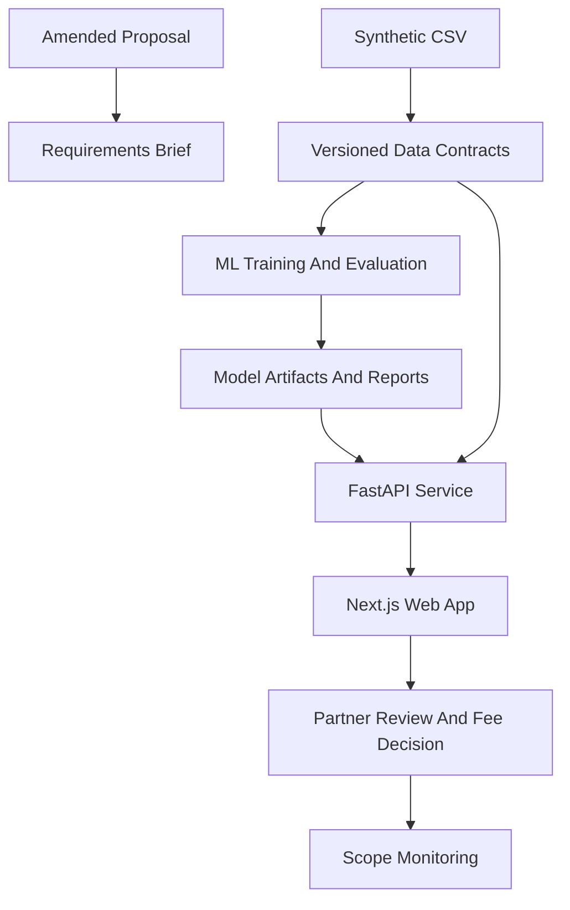

# ProForma Phase 0 Feasibility Architecture Implementation Plan

> **For Claude:** REQUIRED SUB-SKILL: Use superpowers:executing-plans to implement this plan task-by-task.

**Goal:** Convert the amended ProForma HK proposal into a technical feasibility architecture, requirements brief, and governance gates before product code is built.

**Architecture:** This phase produces documentation and repository scaffolding decisions only. It defines a Next.js frontend, Python FastAPI service, Python ML workspace, shared domain schemas, and compliance/governance documents as separate tracks that converge through typed API contracts.

**Tech Stack:** Markdown, ADRs, Mermaid, Python project conventions, Next.js App Router, FastAPI, Pydantic, Postgres-compatible persistence, pytest, Playwright.

---

## Source Context

- Proposal: `docs/proforma-proposal-prelim.html`
- Data dictionary: `docs/data_dictionary.md`
- Validation report: `output/validation_report.md`
- Synthetic generator: `generate_dataset.py`
- Current dataset: `output/proforma_hk_synthetic_mvp.csv`

## Phase Deliverables

- Product requirements brief.
- Technical feasibility architecture brief.
- Repository structure decision.
- Risk register for PDPO, solicitor confidentiality, data residency, model governance, Law Society guidance, and synthetic-data limitations.
- ADRs for model strategy, tenancy, bilingual UX, and deployment/data residency.
- Acceptance checklist separating technical feasibility from regulatory approval.

## Task 1: Write Product Requirements Brief

**Files:**
- Create: `docs/requirements/product-requirements.md`
- Reference: `docs/proforma-proposal-prelim.html`

**Step 1: Extract the amended workflow**

Capture the four product workflow steps from the proposal:

- Matter Parameters.
- Predictive Analysis.
- Fee Structure Recommendation.
- Scope Monitoring.

**Step 2: Define user roles**

Document the minimum Phase 0 roles:

- Partner: reviews estimates and sets fees.
- Associate or pricing support user: prepares matter inputs.
- Admin: manages firm settings, risk tolerance, and data permissions.
- Technical reviewer: inspects model evaluation and feasibility artifacts.

**Step 3: Define non-goals**

Include these explicit exclusions:

- No auto-generated retainer letters in the feasibility build.
- No legal advice.
- No autonomous fee setting.
- No ORFSA module in the first feasibility build.
- No pooled production model until legal review approves it.

**Step 4: Define success criteria**

Add measurable criteria:

- Every prediction response is traceable to dataset version, feature version, and model version.
- Every UI estimate displays uncertainty and decision-support disclaimers.
- Firm-specific and pooled anonymized model tracks can be compared from one evaluation command.
- Synthetic-data mode is visibly labeled across API, frontend, and reports.

**Step 5: Verify**

Run: `python -m pathlib docs/requirements/product-requirements.md`

Expected: command exits 0 if the file path exists and can be resolved.

**Step 6: Commit checkpoint**

Commit message: `docs: add ProForma product requirements brief`

## Task 2: Write Technical Architecture Brief

**Files:**
- Create: `docs/architecture/technical-feasibility-architecture.md`
- Reference: `docs/proforma-proposal-prelim.html`

**Step 1: Document system boundaries**

Describe these boundaries:

- `apps/web`: bilingual Next.js user workflow.
- `services/api`: FastAPI prediction, taxonomy, evaluation, and scope-monitoring API.
- `ml`: training, evaluation, model cards, and artifacts.
- `packages/domain`: shared schema definitions or generated API clients.
- `data`: local development inputs, fixtures, and anonymized import staging.
- `docs`: requirements, ADRs, governance, and phase plans.

**Step 2: Add architecture diagram**

Use this flow as the baseline:



**Step 3: Define service principles**

State:

- The API should expose typed estimates, not raw dataframe rows.
- The model layer should be replaceable without changing frontend contracts.
- Tenancy should be represented from the first API contracts, even in synthetic-only mode.
- Audit events are append-only feasibility evidence, not a full compliance system yet.

**Step 4: Verify**

Run: `rg "FastAPI|Next.js|Model Artifacts" docs/architecture/technical-feasibility-architecture.md`

Expected: all three terms appear.

**Step 5: Commit checkpoint**

Commit message: `docs: add technical feasibility architecture`

## Task 3: Define Repository Structure

**Files:**
- Create: `docs/architecture/repository-structure.md`

**Step 1: Specify target folders**

Document the intended structure:

```text
apps/web/
services/api/
packages/domain/
ml/
data/
docs/requirements/
docs/architecture/
docs/adr/
docs/governance/
docs/plans/
tests/
```

**Step 2: Define ownership**

Map each folder to primary concerns:

- `apps/web`: UI, i18n, accessibility, workflow smoke tests.
- `services/api`: request validation, prediction orchestration, audit logging.
- `packages/domain`: shared schemas, generated clients, stable enums.
- `ml`: feature engineering, model training, evaluation, model cards.
- `data`: fixtures and staging only; no confidential firm data in git.
- `docs/governance`: compliance checklist, threat model, model governance.

**Step 3: Verify**

Run: `rg "apps/web|services/api|ml/" docs/architecture/repository-structure.md`

Expected: each target folder appears.

**Step 4: Commit checkpoint**

Commit message: `docs: define ProForma repository structure`

## Task 4: Write Architecture Decision Records

**Files:**
- Create: `docs/adr/0001-research-first-modular-monorepo.md`
- Create: `docs/adr/0002-compare-firm-specific-and-pooled-models.md`
- Create: `docs/adr/0003-tenant-aware-contracts-before-real-tenancy.md`
- Create: `docs/adr/0004-bilingual-ui-through-reviewed-translation-catalog.md`
- Create: `docs/adr/0005-data-residency-and-deployment-gate.md`

**Step 1: Use a consistent ADR format**

Each ADR should include:

- Status.
- Context.
- Decision.
- Consequences.
- Open questions.

**Step 2: Record model strategy**

For `0002`, state that firm-specific modeling is the first product-safe path, while pooled anonymized modeling is a research track gated by legal review.

**Step 3: Record tenancy strategy**

For `0003`, state that tenant IDs and model version IDs appear in contracts from the start, even before multi-tenant production infrastructure exists.

**Step 4: Verify**

Run: `rg "Status:|Decision|Consequences" docs/adr`

Expected: every ADR contains those headings.

**Step 5: Commit checkpoint**

Commit message: `docs: add initial architecture decisions`

## Task 5: Create Risk Register And Acceptance Checklist

**Files:**
- Create: `docs/governance/risk-register.md`
- Create: `docs/governance/phase-0-acceptance-checklist.md`

**Step 1: Add risk categories**

Include:

- Synthetic-data overclaiming.
- PDPO compliance.
- Solicitor confidentiality.
- Pooled model legal basis.
- Data residency.
- Model accuracy and calibration.
- Bilingual legal terminology.
- Scope-creep monitoring misuse.

**Step 2: Add gate definitions**

Use these states:

- Technically ready.
- Requires legal review.
- Requires pilot evidence.
- Out of scope for feasibility.

**Step 3: Define Phase 0 acceptance**

Phase 0 is complete when:

- Requirements brief exists.
- Architecture brief exists.
- ADRs exist.
- Risk register exists.
- Acceptance checklist exists.
- All later phase plans reference Phase 0 decisions.

**Step 4: Verify**

Run: `rg "Requires legal review|Technically ready|Synthetic-data" docs/governance`

Expected: all gate language appears.

**Step 5: Commit checkpoint**

Commit message: `docs: add feasibility risk register`

## Phase 0 Final Verification

Run:

```bash
rg "decision-support|firm-specific|pooled|PDPO|tenant|bilingual" docs/requirements docs/architecture docs/adr docs/governance
```

Expected:

- All core proposal constraints are represented.
- No document describes ProForma as autonomous legal advice.
- Pooled modeling is clearly marked as legally gated.

